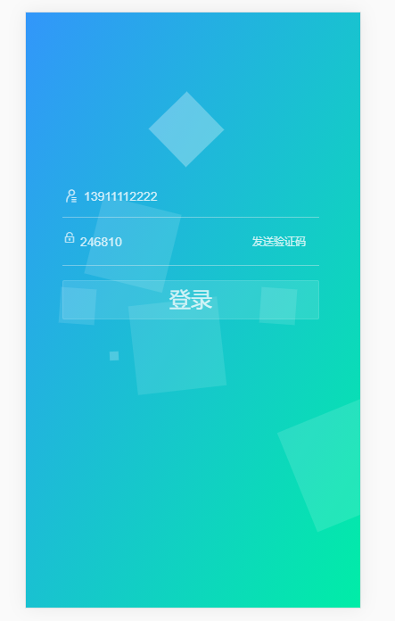
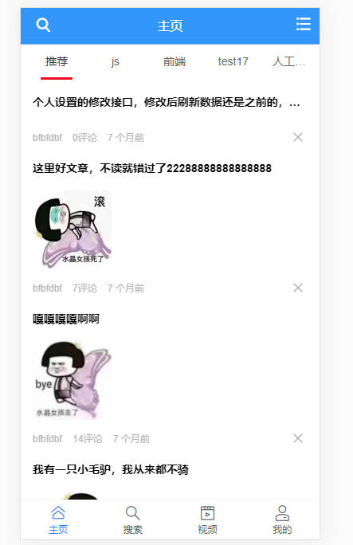
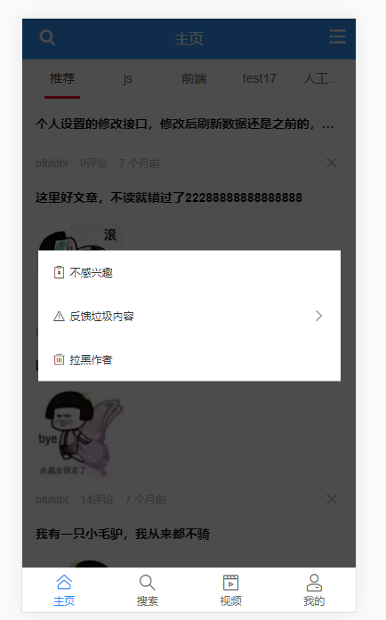
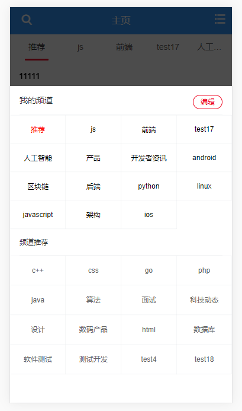
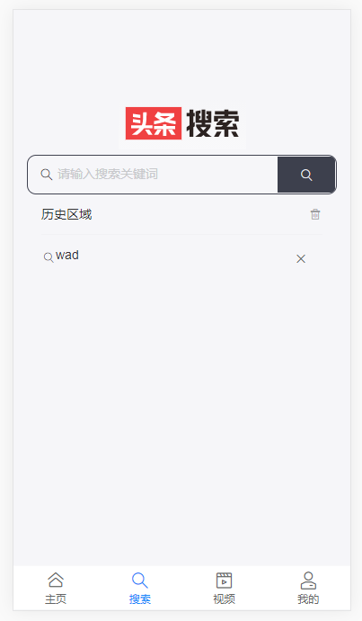
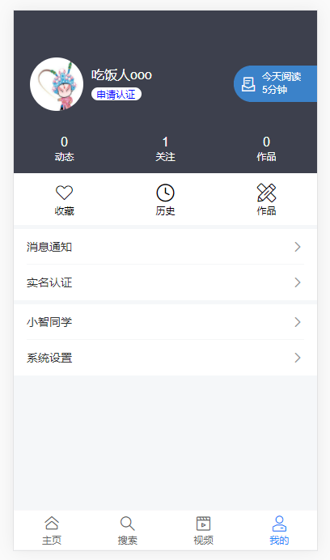
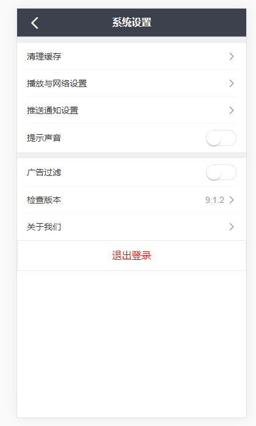

# 移动端项目

## 克隆仓库下来后 先
```
npm install
```

### 运行项目 
```
npm run serve
```

### Compiles and minifies for production
```
npm run build
```

### 
### Customize configuration
See [Configuration Reference](https://cli.vuejs.org/config/).


## 使用技术

### vue2.0全家桶和 Vant-ui


## 项目简介

##### 项目比较简约 接口是网上找的 具体布局什么的都是找的加自己的想法做出来的

关于页面的适应问题我是用了 flexible.js 和 normalize.css 和 postcss-pxtorem（px自动转换rem）来处理


#### 项目预览效果图













